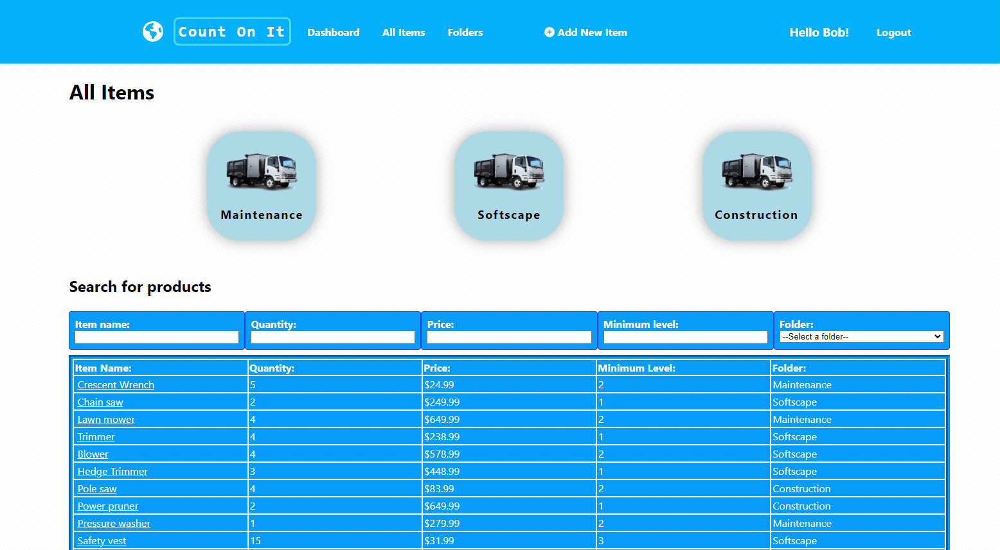
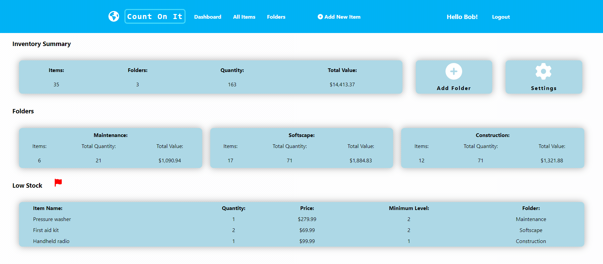
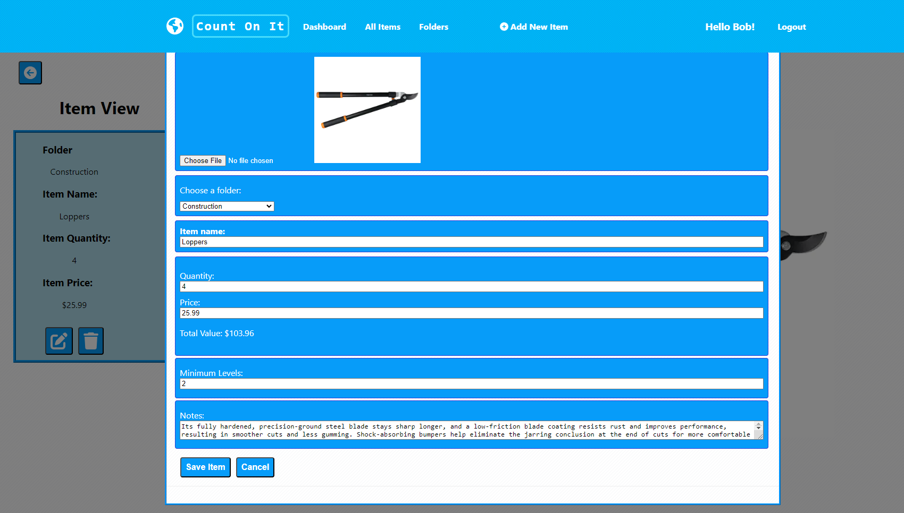
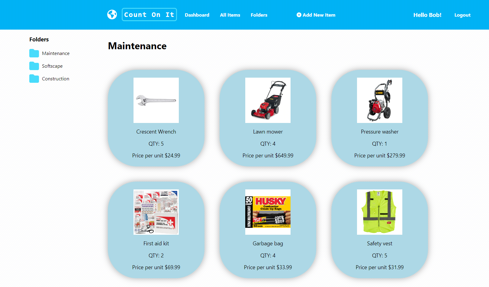

## Count on it.

This is a react + rails inventory app that will help any organization or person manage their assets. Whether you're a lab user or a landscaper, Count On It can help make your life easier.

## Screenshots

 

 

 

 

## Setup

Follow these steps to get Count On It running. Note: this app uses `Ruby 3.1.1`, `Rails 6.1.5.1` and `React 16.8.6`.

1. Clone the repository: `git clone git@github.com:user/countonit.git count-on-it`
2. Install the backend's dependencies in the root project directory: `bundle install`
3. Start the backend server: `rails s`
4. Install the frontend's dependencies by navigating to the `client` folder and running: `npm install`
5. Start the frontend server: `npm start`
